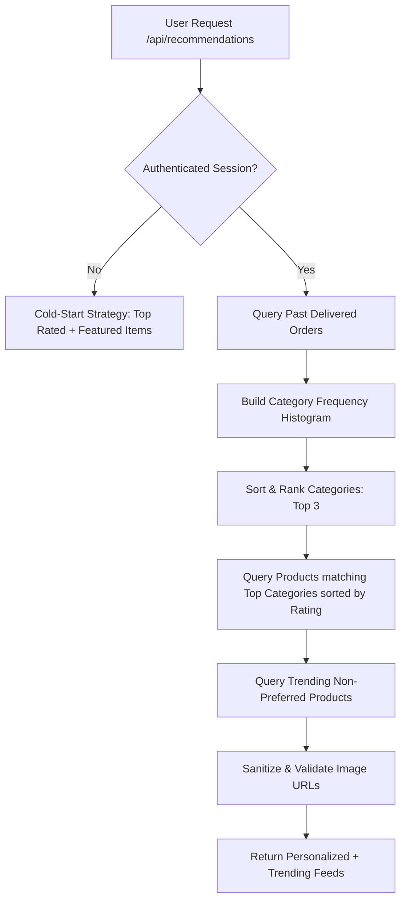
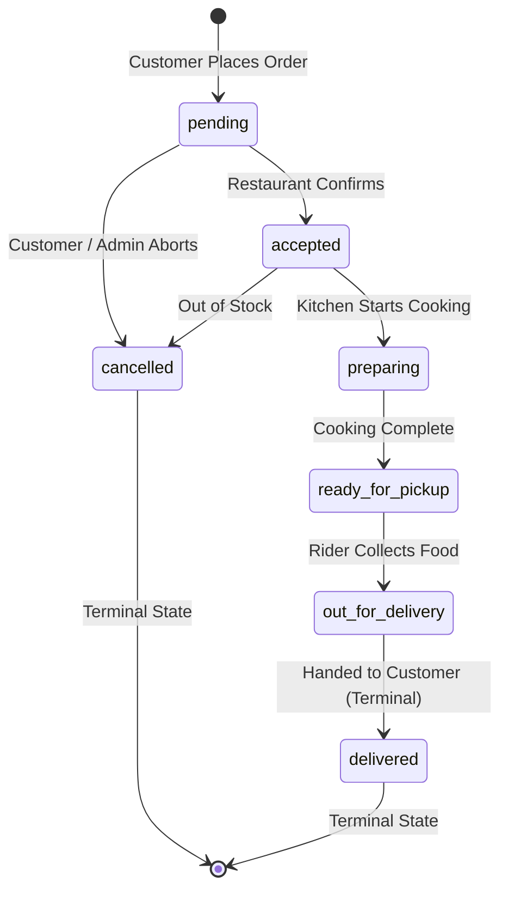

# BiteRush 2.0: Complete Algorithms & Theoretical Viva Defense Guide

> **Prepared for**: CSE 447 / Cryptography & System Security Course Defense & Viva  
> **System**: BiteRush 2.0 — Secure Food Delivery & Logistics Platform  
> **Key Focus**: Cryptographic Algorithms, Number Theory, Operational Algorithms, Code Mapping & Viva Q&A

---

## Quick Navigation Index

1. [Architectural Overview: The BiteRush 2.0 Hybrid Cryptosystem](#1-architectural-overview-the-hybrid-cryptosystem)
2. [Cryptographic Algorithms (From-Scratch & Applied)](#2-cryptographic-algorithms)
   - [2.1 RSA-1024 with PKCS#1 v1.5 Padding (Asymmetric Encryption)](#21-rsa-1024-with-pkcs1-v15-padding)
   - [2.2 ECC secp256k1 / ECIES (Elliptic Curve Cryptography)](#22-ecc-secp256k1--ecies-elliptic-curve-cryptography)
   - [2.3 SHA-256 Cryptographic Hash Function (FIPS 180-4)](#23-sha-256-cryptographic-hash-function-fips-180-4)
   - [2.4 HMAC-SHA256 (Keyed-Hash Message Authentication Code - RFC 2104)](#24-hmac-sha256-keyed-hash-message-authentication-code---rfc-2104)
   - [2.5 Deterministic Blind Indexing (Searchable Encrypted Database)](#25-deterministic-blind-indexing-searchable-encrypted-database)
   - [2.6 Dynamic Truncation & OTP Generation (RFC 4226 HOTP / RFC 6238 TOTP)](#26-dynamic-truncation--otp-generation-rfc-4226-hotp--rfc-6238-totp)
   - [2.7 Bcrypt Key Derivation Function (Salted Password Hashing)](#27-bcrypt-key-derivation-function-salted-password-hashing)
3. [Number-Theoretic & Computational Primitives](#3-number-theoretic--computational-primitives)
   - [3.1 Extended Euclidean Algorithm & Modular Inverse](#31-extended-euclidean-algorithm--modular-inverse)
   - [3.2 Binary Exponentiation (Square-and-Multiply)](#32-binary-exponentiation-square-and-multiply)
   - [3.3 Miller-Rabin Probabilistic Primality Test](#33-miller-rabin-probabilistic-primality-test)
   - [3.4 Tonelli-Shanks Algorithm & Legendre Symbol](#34-tonelli-shanks-algorithm--legendre-symbol)
4. [Application & System Algorithms](#4-application--system-algorithms)
   - [4.1 Personalized Content-Based Recommendation Algorithm](#41-personalized-content-based-recommendation-algorithm)
   - [4.2 Order Lifecycle Finite State Machine (FSM)](#42-order-lifecycle-finite-state-machine-fsm)
   - [4.3 In-Memory Decryption Search & Dynamic Merging](#43-in-memory-decryption-search--dynamic-merging)
   - [4.4 Serverless Resilient Connection Pooling & Stale Socket Eviction](#44-serverless-resilient-connection-pooling--stale-socket-eviction)
5. [Top 20 Viva Questions & Winning Answers (Examiner Traps Busted)](#5-top-20-viva-questions--winning-answers)

---

# 1. Architectural Overview: The Hybrid Cryptosystem

BiteRush 2.0 does not rely on naive monolithic encryption. Instead, it implements a **layered, defense-in-depth hybrid cryptosystem** designed specifically for real-world enterprise databases:

```
+---------------------------------------------------------------------------------------+
|                                    BITERUSH 2.0                                       |
+---------------------------------------------------------------------------------------+
|  1. Passwords At Rest     -->  Bcrypt (cost=10, 1024 salt rounds, Blowfish KDF)       |
|  2. User PII At Rest      -->  RSA-1024 + PKCS#1 v1.5 Padding (Asymmetric Keypair)    |
|  3. Fast Search on PII    -->  HMAC-SHA256 Deterministic Blind Indexing (Peppered)    |
|  4. Ephemeral Comms       -->  ECC secp256k1 / Koblitz Embedding (Posts, Chat, Reviews)|
|  5. 2FA Two-Step Auth     -->  HMAC-SHA256 Dynamic Truncation (RFC 4226 / RFC 6238)   |
|  6. Database Row Integrity-->  HMAC-SHA256 Data Integrity MAC (Tamper Prevention)     |
+---------------------------------------------------------------------------------------+
```

### Why Hybrid? (The Professor's Favorite Question)
* **Why not encrypt the whole DB with AES?** Symmetric encryption (AES) requires storing the decryption key on the server. If the server is breached, every record is instantly decrypted. Moreover, database indexes on AES ciphertexts are randomized (non-deterministic (CBC/GCM)), meaning `SELECT * WHERE email = ?` requires full-table scans and decrypting every row in memory.
* **Why not RSA for everything?** RSA modular exponentiation with 1024/2048-bit numbers is computationally expensive and slow for high-frequency messages (like live order chat).
* **The Solution**: 
  - **RSA-1024** for sensitive static User PII (`firstName`, `lastName`, `email`, `contactNumber`).
  - **ECC secp256k1** for dynamic, transactional communications (community posts, chats, delivery notes).
  - **HMAC-SHA256 Blind Indexes** for $O(1)$ database indexing and querying without decrypting rows.

---

# 2. Cryptographic Algorithms

---

## 2.1 RSA-1024 with PKCS#1 v1.5 Padding

* **File**: [`src/lib/crypto/rsa.ts`](file:///Users/ftniloy/Desktop/BiteRush-main/src/lib/crypto/rsa.ts), [`src/lib/crypto/cryptoService.ts`](file:///Users/ftniloy/Desktop/BiteRush-main/src/lib/crypto/cryptoService.ts)
* **Primary Functions**: `generateRSAKeyPair()`, `padPKCS1v15()`, `unpadPKCS1v15()`, `rsaEncrypt()`, `rsaDecrypt()`

### Theoretical Explanation
RSA is an asymmetric public-key cryptosystem named after Ron Rivest, Adi Shamir, and Leonard Adleman (1977). Its mathematical security rests on the **intractability of the Integer Factorization Problem**: multiplying two large prime numbers $p$ and $q$ is computationally trivial ($O(n^2)$), but finding $p$ and $q$ given their product $N = p \cdot q$ is sub-exponentially hard (General Number Field Sieve).

### Mathematical Formulation
1. **Key Generation**:
   - Choose two distinct 512-bit prime numbers $p$ and $q$ using the Miller-Rabin primality test.
   - Compute modulus:
     $$N = p \times q \quad (\text{1024 bits})$$
   - Compute Euler's totient function:
     $$\phi(N) = (p - 1)(q - 1)$$
   - Choose public exponent $e$ coprime to $\phi(N)$:
     $$e = 65537 \quad (2^{16} + 1, \text{ Fermat prime } F_4)$$
     $$\gcd(e, \phi(N)) = 1$$
   - Compute private exponent $d$ using the Extended Euclidean Algorithm:
     $$d \equiv e^{-1} \pmod{\phi(N)} \implies e \cdot d \equiv 1 \pmod{\phi(N)}$$
   - **Public Key**: $(e, N)$  
   - **Private Key**: $(d, N)$

2. **Encryption**:
   $$C \equiv M^e \pmod N$$

3. **Decryption** (by Euler's Totient Theorem & Chinese Remainder Theorem):
   $$M \equiv C^d \equiv (M^e)^d \equiv M^{k\phi(N) + 1} \equiv M \pmod N$$

### PKCS#1 v1.5 Padding Structure
Raw ("textbook") RSA is vulnerable to small root attacks, homomorphism ($C_1 \cdot C_2 \equiv (M_1 \cdot M_2)^e$), and determinism. BiteRush implements **PKCS#1 v1.5 Padding**:
```
Byte Position:  0x00 | 0x01 | 0x02 ... PS ... | 0x00 | Data Chunk (M)
Byte Value:     0x00 | 0x02 | Non-zero Random | 0x00 | Plaintext Bytes
```
- **Total Block Size ($k$)**: 128 bytes (1024 bits).
- **Maximum Plaintext Chunk**: $k - 11 = 117$ bytes.
- **Padding String (PS)**: At least 8 non-zero cryptographically secure random bytes generated via CSPRNG.

### Code Implementation Snapshot
```typescript
// From src/lib/crypto/rsa.ts:
const k = Math.ceil(publicKey.n.toString(16).length / 2); // 128 bytes
const maxChunkSize = k - 11; // 117 bytes

// Pad and encrypt block
const padded = padPKCS1v15(chunk, k);
const m = bytesToBigInt(padded);
const c = modPow(m, publicKey.e, publicKey.n); // c = m^e mod n
```

---

## 2.2 ECC secp256k1 / ECIES (Elliptic Curve Cryptography)

* **File**: [`src/lib/crypto/ecc.ts`](file:///Users/ftniloy/Desktop/BiteRush-main/src/lib/crypto/ecc.ts), [`src/lib/crypto/eccChunk.ts`](file:///Users/ftniloy/Desktop/BiteRush-main/src/lib/crypto/eccChunk.ts)
* **Primary Functions**: `pointAdd()`, `pointDouble()`, `scalarMultiply()`, `koblitzEncode()`, `eccEncrypt()`, `eccDecrypt()`

### Theoretical Explanation
Elliptic Curve Cryptography relies on the algebraic structure of elliptic curves over finite fields $\mathbb{F}_p$. Its security relies on the **Elliptic Curve Discrete Logarithm Problem (ECDLP)**: Given base point $G$ and public point $Q = d \cdot G$, it is computationally infeasible to determine scalar $d$.  
BiteRush uses the **secp256k1 Koblitz curve** (standardized by Certicom, also used by Bitcoin and Ethereum).

### Curve Equation & Parameters
$$\mathbf{E: } \quad y^2 \equiv x^3 + 7 \pmod p$$
- **Prime field modulus $p$**: $2^{256} - 2^{32} - 977 = \text{0xFFFFFFFFFFFFFFFFFFFFFFFFFFFFFFFFFFFFFFFFFFFFFFFFFFFFFFFEFFFFFC2F}$
- **Curve coefficients**: $a = 0, \quad b = 7$
- **Base generator point $G$**: $(G_x, G_y)$
- **Order $n$**: $0\text{xFFFFFFFFFFFFFFFFFFFFFFFFFFFEBAAEDCE6AF48A03BBFD25E8CD0364141}$

### Group Arithmetic Over $\mathbb{F}_p$
1. **Point Addition ($P + Q = R$)**:
   $$\lambda = \frac{y_2 - y_1}{x_2 - x_1} \pmod p$$
   $$x_3 = \lambda^2 - x_1 - x_2 \pmod p, \quad y_3 = \lambda(x_1 - x_3) - y_1 \pmod p$$

2. **Point Doubling ($2P = R$)**:
   $$\lambda = \frac{3x_1^2 + a}{2y_1} \pmod p = \frac{3x_1^2}{2y_1} \pmod p \quad (\text{since } a = 0)$$
   $$x_3 = \lambda^2 - 2x_1 \pmod p, \quad y_3 = \lambda(x_1 - x_3) - y_1 \pmod p$$

3. **Scalar Multiplication ($k \cdot P$)**:
   Implemented using the **Double-and-Add algorithm** (the elliptic curve analog of modular square-and-multiply) executing in $O(\log k)$ point additions and doublings.

### Koblitz's Message Embedding Algorithm
Because arbitrary text bytes $M$ do not inherently satisfy $y^2 = x^3 + 7 \pmod p$, BiteRush employs Neal Koblitz's embedding technique:
1. For message byte integer $m$, construct $x = m \cdot K + j$ for $j \in [0, K-1]$ (with parameter $K = 100$).
2. Evaluate $v = x^3 + 7 \pmod p$.
3. Test if $v$ is a quadratic residue modulo $p$ using the **Euler Criterion / Legendre Symbol**:
   $$\left(\frac{v}{p}\right) \equiv v^{(p-1)/2} \pmod p$$
   If $\equiv 1$, a valid $y$ exists!
4. Compute $y = \text{tonelliShanks}(v, p)$. The message point is $M = (x, y)$.

### ElGamal / Diffie-Hellman EC Encryption
To encrypt message point $M$ with public key $Q = d \cdot G$:
1. Choose ephemeral random integer $k \in_R [1, n-1]$.
2. Compute:
   $$C_1 = k \cdot G \quad (\text{ephemeral public key})$$
   $$C_2 = M + k \cdot Q \quad (\text{masked message point})$$
3. **Ciphertext**: $(C_1, C_2)$
4. **Decryption**:
   $$M = C_2 - d \cdot C_1 = (M + k \cdot Q) - d \cdot (k \cdot G) = M + k(d \cdot G) - k(d \cdot G) = M$$
5. Recover original message: $m = \lfloor x_M / K \rfloor$.

---

## 2.3 SHA-256 Cryptographic Hash Function (FIPS 180-4)

* **File**: [`src/lib/crypto/sha256.ts`](file:///Users/ftniloy/Desktop/BiteRush-main/src/lib/crypto/sha256.ts)
* **Primary Functions**: `sha256Bytes()`, `sha256Hex()`

### Theoretical Explanation
SHA-256 is an iterated cryptographic hash function designed by the NSA and standardized under NIST FIPS 180-4. It maps an arbitrary-length message $M$ ($< 2^{64}$ bits) to a fixed 256-bit (32-byte) digest. It is built upon the **Merkle–Damgård construction** with a compression function based on the Davies–Meyer structure.

### Algorithm Steps Implemented From Scratch
1. **Padding**:
   - Append a single bit `1` (`0x80`).
   - Append $k$ zero bits such that $(L + 1 + k) \equiv 448 \pmod{512}$.
   - Append original message length $L$ as a 64-bit big-endian integer.
2. **State Initialization**:
   8 initial 32-bit state registers ($H_0 \dots H_7$) initialized with the fractional parts of the square roots of the first 8 primes:
   `0x6a09e667, 0xbb67ae85, 0x3c6ef372, 0xa54ff53a, 0x510e527f, 0x9b05688c, 0x1f83d9ab, 0x5be0cd19`
3. **Message Schedule ($W_0 \dots W_{63}$)**:
   For each 512-bit block:
   $$W_t = \begin{cases} M_t^{(i)} & 0 \le t \le 15 \\ \sigma_1(W_{t-2}) + W_{t-7} + \sigma_0(W_{t-15}) + W_{t-16} & 16 \le t \le 63 \end{cases}$$
4. **Compression Functions**:
   $$\text{Ch}(x, y, z) = (x \wedge y) \oplus (\neg x \wedge z)$$
   $$\text{Maj}(x, y, z) = (x \wedge y) \oplus (x \wedge z) \oplus (y \wedge z)$$
   $$\Sigma_0(x) = \text{ROTR}^2(x) \oplus \text{ROTR}^{13}(x) \oplus \text{ROTR}^{22}(x)$$
   $$\Sigma_1(x) = \text{ROTR}^6(x) \oplus \text{ROTR}^{11}(x) \oplus \text{ROTR}^{25}(x)$$
   $$\sigma_0(x) = \text{ROTR}^7(x) \oplus \text{ROTR}^{18}(x) \oplus (x \gg 3)$$
   $$\sigma_1(x) = \text{ROTR}^{17}(x) \oplus \text{ROTR}^{19}(x) \oplus (x \gg 10)$$
5. **64 Processing Rounds**:
   $$T_1 = h + \Sigma_1(e) + \text{Ch}(e, f, g) + K_t + W_t$$
   $$T_2 = \Sigma_0(a) + \text{Maj}(a, b, c)$$
   $h = g; \quad g = f; \quad f = e; \quad e = d + T_1; \quad d = c; \quad c = b; \quad b = a; \quad a = T_1 + T_2;$

---

## 2.4 HMAC-SHA256 (Keyed-Hash Message Authentication Code - RFC 2104)

* **File**: [`src/lib/crypto/hmac.ts`](file:///Users/ftniloy/Desktop/BiteRush-main/src/lib/crypto/hmac.ts)
* **Primary Functions**: `hmacSha256Bytes()`, `hmacSha256Hex()`, `generateDataIntegrityMac()`, `verifyDataIntegrityMac()`

### Theoretical Explanation
A simple hash $H(K \parallel m)$ is vulnerable to **Length Extension Attacks** in Merkle-Damgård constructions: an adversary knowing $H(K \parallel m)$ and the length of $K \parallel m$ can append data $m'$ and calculate $H(K \parallel m \parallel \text{padding} \parallel m')$ without knowing key $K$.  
HMAC completely immunizes against length extension by employing a nested, two-pass hash construction defined in RFC 2104:

$$\mathbf{HMAC}(K, m) = H\Big((K' \oplus \text{opad}) \parallel H\big((K' \oplus \text{ipad}) \parallel m\big)\Big)$$

Where:
- $K'$ is the key pre-processed to 64 bytes (hashed if $> 64$ bytes, zero-padded if $< 64$ bytes).
- $\text{ipad} = \text{0x36}$ repeated 64 times (inner padding).
- $\text{opad} = \text{0x5C}$ repeated 64 times (outer padding).

---

## 2.5 Deterministic Blind Indexing (Searchable Encrypted Database)

* **Files**: [`src/lib/crypto/hmac.ts`](file:///Users/ftniloy/Desktop/BiteRush-main/src/lib/crypto/hmac.ts#L60), [`src/models/User.ts`](file:///Users/ftniloy/Desktop/BiteRush-main/src/models/User.ts#L105), [`src/app/api/sign-up/route.ts`](file:///Users/ftniloy/Desktop/BiteRush-main/src/app/api/sign-up/route.ts#L45)
* **Primary Functions**: `createBlindLookupToken()`, `createEmailLookupHmac()`, `createPhoneLookupHmac()`

### The Challenge
When user email addresses and phone numbers are encrypted with RSA and PKCS#1 v1.5 padding, **the ciphertext is randomized**. Encrypting `"john@example.com"` 10 times yields 10 completely different ciphertexts. Therefore, MongoDB cannot index the field, and running:
```javascript
db.users.findOne({ email: "john@example.com" })
```
would fail or require decrypting all database rows on every search request ($O(N)$ CPU bottleneck).

### The Solution: Deterministic Peppered Blind Index
We generate a one-way deterministic blind index token:
$$\text{emailLookupHmac} = \text{HMAC-SHA256}(K_{\text{pepper}}, \text{normalize}(\text{email}))$$

1. **Normalization**: `email.toLowerCase().trim()` guarantees consistent token generation.
2. **Server Pepper ($K_{\text{pepper}}$)**: Secret key stored only in environment variables (`PEPPER_SECRET`). Even if the database is leaked via SQL/NoSQL injection, attackers cannot perform dictionary or rainbow table attacks against the blind indexes without the pepper key.
3. **Querying**: Fast $O(1)$ B-Tree index lookup:
```typescript
const emailLookupHmac = CryptoService.createEmailLookupHmac(inputEmail);
const user = await User.findOne({ emailLookupHmac });
```

---

## 2.6 Dynamic Truncation & OTP Generation (RFC 4226 HOTP / RFC 6238 TOTP)

* **File**: [`src/lib/crypto/otp.ts`](file:///Users/ftniloy/Desktop/BiteRush-main/src/lib/crypto/otp.ts)
* **Primary Functions**: `dynamicTruncation()`, `generateHOTP()`, `generateTOTP()`, `generateVerificationOtp()`, `verifyStoredOtp()`

### Theoretical Explanation
BiteRush implements standard **RFC 4226 (HOTP)** and **RFC 6238 (TOTP)** Dynamic Truncation algorithms from scratch.

### Algorithm
1. Generate 32-byte HMAC-SHA256 digest:
   $$HS = \text{HMAC-SHA256}(K, C)$$
   where $C$ is an 8-byte big-endian counter or timestamp window ($\lfloor \text{Time} / T_{\text{step}} \rfloor$).
2. **Dynamic Truncation**:
   - Take the lowest 4 bits of the 32nd byte as an offset:
     $$\text{offset} = HS[31] \ \& \ \text{0x0F} \quad (\text{value between } 0 \text{ and } 15)$$
   - Extract a 4-byte chunk starting at `offset`:
     $$P = HS[\text{offset} \dots \text{offset} + 3]$$
   - Mask the most significant bit (MSB) to avoid signed integer ambiguities:
     $$\text{binaryCode} = ((P[0] \ \& \ \text{0x7F}) \ll 24) \ | \ ((P[1] \ \& \ \text{0xFF}) \ll 16) \ | \ ((P[2] \ \& \ \text{0xFF}) \ll 8) \ | \ (P[3] \ \& \ \text{0xFF})$$
3. **Modulo Reduction**:
   $$\text{OTP} = \text{binaryCode} \pmod{10^6}$$
   Left-padded with zeros to guarantee a 6-digit numeric string (e.g., `"042918"`).

---

## 2.7 Bcrypt Key Derivation Function (Salted Password Hashing)

* **Files**: [`src/app/api/sign-up/route.ts`](file:///Users/ftniloy/Desktop/BiteRush-main/src/app/api/sign-up/route.ts#L42), [`src/app/api/auth/login-challenge/route.ts`](file:///Users/ftniloy/Desktop/BiteRush-main/src/app/api/auth/login-challenge/route.ts#L85), [`src/app/api/auth/[...nextauth]/option.ts`](file:///Users/ftniloy/Desktop/BiteRush-main/src/app/api/auth/[...nextauth]/option.ts#L74)

### Theoretical Explanation
Designed by Niels Provos and David Mazières (1999) based on the **Eksblowfish (Expensive Key Schedule Blowfish)** cipher.
Unlike fast general-purpose hashes (SHA-256, MD5) which can be computed billions of times per second on GPUs, Bcrypt is **intentionally computationally expensive**:
- **Automatic Salt**: Generates a 128-bit cryptographically secure random salt to defeat rainbow tables.
- **Cost Factor ($2^{\text{cost}}$ iterations)**: BiteRush uses cost `10` ($2^{10} = 1024$ key expansion rounds), forcing an attacker to expend substantial CPU cycles per password guess.

---

# 3. Number-Theoretic & Computational Primitives

All number-theoretic algorithms are implemented from scratch in [`src/lib/crypto/math.ts`](file:///Users/ftniloy/Desktop/BiteRush-main/src/lib/crypto/math.ts) using JavaScript native `BigInt`.

---

## 3.1 Extended Euclidean Algorithm & Modular Inverse

* **Function**: `extendedGCD(a, b)`, `modInverse(a, m)`
* **Bézout's Identity**: For any integers $a$ and $b$, there exist integers $x$ and $y$ such that:
  $$a \cdot x + b \cdot y = \gcd(a, b)$$
* **Modular Multiplicative Inverse**: If $\gcd(a, m) = 1$, then:
  $$a \cdot x + m \cdot y = 1 \implies a \cdot x \equiv 1 \pmod m \implies a^{-1} \equiv x \pmod m$$
* **Complexity**: $O(\log(\min(a, b)))$ steps.

---

## 3.2 Binary Exponentiation (Square-and-Multiply)

* **Function**: `modPow(base, exponent, modulus)`
* **Theoretical Goal**: Computes $b^e \pmod m$ without computing astronomical intermediate numbers like $b^e$.
* **Algorithm**:
  - Express exponent in binary: $e = \sum_{i=0}^{k-1} e_i 2^i$.
  - Scan bits from right to left: Square base on each step ($b \leftarrow b^2 \pmod m$); multiply result when bit is 1 ($res \leftarrow res \cdot b \pmod m$).
* **Complexity**: Reduces complexity from $O(e)$ multiplications to $O(\log e)$ multiplications.

---

## 3.3 Miller-Rabin Probabilistic Primality Test

* **Function**: `millerRabin(n, iterations = 25)`, `randomPrime(bitLength)`
* **Theoretical Goal**: Determine whether a large 512-bit integer is prime.
* **Algorithm**:
  1. Filter small primes ($2, 3, 5, \dots, 997$) for $O(1)$ fast rejection of composites.
  2. Write $n - 1 = 2^s \cdot d$ with $d$ odd.
  3. Pick random base $a \in [2, n-2]$.
  4. Compute $x = a^d \pmod n$. If $x = 1$ or $x = n-1$, candidate passes this round.
  5. Square $x$ up to $s-1$ times: $x \leftarrow x^2 \pmod n$. If $x = n-1$, it passes.
  6. If it never reaches $n-1$, $n$ is **definitely composite**.
* **Error Probability**: For $k = 25$ iterations, error probability is $\le 4^{-25} \approx 8.88 \times 10^{-16}$ (statistically impossible to falsely identify a composite as prime).

---

## 3.4 Tonelli-Shanks Algorithm & Legendre Symbol

* **Function**: `legendreSymbol(a, p)`, `tonelliShanks(n, p)`
* **Theoretical Goal**: Solve quadratic congruence $r^2 \equiv n \pmod p$ to find the $y$-coordinate corresponding to $x$ in Elliptic Curve point embedding.
* **Euler's Criterion (Legendre Symbol)**:
  $$\left(\frac{a}{p}\right) \equiv a^{(p-1)/2} \pmod p = \begin{cases} 1 & \text{if } a \text{ is a quadratic residue} \\ -1 & \text{if } a \text{ is a quadratic non-residue} \\ 0 & \text{if } a \equiv 0 \pmod p \end{cases}$$
* **Tonelli-Shanks**: Factors $p - 1 = q \cdot 2^s$, finds a quadratic non-residue $z$, and performs iterative power corrections in subgroup of order $2^s$.

---

# 4. Application & System Algorithms

---

## 4.1 Personalized Content-Based Recommendation Algorithm

* **File**: [`src/app/api/recommendations/route.ts`](file:///Users/ftniloy/Desktop/BiteRush-main/src/app/api/recommendations/route.ts)
* **Goal**: Deliver intelligent product recommendations based on user ordering patterns.



### Mathematical Scoring & Algorithm Steps
1. **Histogram Construction**:
   $$\text{Score}(C) = \sum_{o \in \text{Orders}} \sum_{i \in o.\text{items}} \text{quantity}_i \quad \text{for } \text{product}_i.\text{category} = C$$
2. **Preference Ranking**:
   $$\vec{P} = \text{argsort}_{\text{desc}}(\text{Score}(C))[0 \dots 2]$$
3. **Product Filtering**:
   - Filter catalog: $\text{category} \in \vec{P} \ \wedge \ \text{inStock} = \text{true}$.
   - Sort by descending `rating` ($\ge 4.5$), limit to 6 items.
4. **Trending Fallback**:
   - Non-preferred catalog items sorted by `rating` and `numReviews`.

---

## 4.2 Order Lifecycle Finite State Machine (FSM)

* **Files**: [`src/models/Order.ts`](file:///Users/ftniloy/Desktop/BiteRush-main/src/models/Order.ts), [`src/app/api/orders/[id]/route.ts`](file:///Users/ftniloy/Desktop/BiteRush-main/src/app/api/orders/%5Bid%5D/route.ts), [`src/app/api/admin/orders/[id]/route.ts`](file:///Users/ftniloy/Desktop/BiteRush-main/src/app/api/admin/orders/%5Bid%5D/route.ts)
* **Goal**: Prevent illegal state transitions in delivery logistics.



**State Transition Matrix**:
| Current State | Valid Next States | Authorized Roles |
|---|---|---|
| `pending` | `accepted`, `cancelled` | Restaurant, Admin |
| `accepted` | `preparing`, `cancelled` | Restaurant, Admin |
| `preparing` | `ready_for_pickup` | Restaurant, Kitchen Staff |
| `ready_for_pickup` | `out_for_delivery` | Rider, Admin |
| `out_for_delivery` | `delivered` | Rider |
| `delivered` / `cancelled` | *(None - Terminal)* | None |

---

## 4.3 In-Memory Decryption Search & Dynamic Merging

* **File**: [`src/app/api/admin/users/route.ts`](file:///Users/ftniloy/Desktop/BiteRush-main/src/app/api/admin/users/route.ts#L61)
* **Goal**: Allow Admin to search users by partial first name, last name, phone, or restaurant name, even though these fields are RSA-encrypted in MongoDB.

### Algorithm Steps:
1. **Query Matching Role**: Query database using role filter (`customer`, `rider`, `restaurant`, `admin`).
2. **In-Memory Decryption**: Iterate through records and decrypt RSA ciphertext blocks using `CryptoService.decryptProfile()`.
3. **Sanitization**: Filter out any un-decrypted placeholders (`"[ENCRYPTED]"`).
4. **Multi-Field Substring Matching**:
   $$\text{Match} \iff \text{search} \subseteq \text{firstName} \ \vee \ \text{search} \subseteq \text{lastName} \ \vee \ \text{search} \subseteq \text{email} \ \vee \ \text{search} \subseteq \text{contact}$$
5. **Dynamic Slicing**: Slice array according to pagination parameters (`skip`, `skip + limit`).

---

## 4.4 Serverless Resilient Connection Pooling & Stale Socket Eviction

* **File**: [`src/lib/dbConnect.ts`](file:///Users/ftniloy/Desktop/BiteRush-main/src/lib/dbConnect.ts)
* **Goal**: Prevent stale connection reuse and memory leaks across AWS Lambda / Vercel Serverless container freezes.

### Algorithm
```typescript
// 1. If connection is already alive, reuse immediately
if (cached.conn && mongoose.connection.readyState === 1) {
  return cached.conn;
}

// 2. If connection is dead (0) or disconnecting (3), purge stale cache
if (mongoose.connection.readyState === 0 || mongoose.connection.readyState === 3) {
  cached.promise = null;
  cached.conn = null;
}

// 3. Thread-safe single promise initialization
if (!cached.promise) {
  cached.promise = mongoose.connect(uri, {
    serverSelectionTimeoutMS: 10000,
    maxPoolSize: 10,
  });
}
```

---

# 5. Top 20 Viva Questions & Winning Answers

### Q1: Why did you implement RSA and ECC from scratch rather than just using standard libraries?
> **Answer**: Implementing from-scratch math (`BigInt`, Miller-Rabin, Extended GCD, Square-and-Multiply, and Weierstrass Point Arithmetic) proves deep theoretical understanding of asymmetric public key algorithms, finite fields, and group law. It avoids black-box dependency and allows custom chunking and key serialization tailored to our application data envelope.

### Q2: Why is the public exponent $e = 65537$ in RSA?
> **Answer**: $65537 = 2^{16} + 1$ (the 4th Fermat prime, $F_4$). In binary, it is `10000000000000001` (only two `1` bits). This allows modular exponentiation using binary square-and-multiply to complete with only 16 squarings and 1 multiplication, making public-key encryption and signature verification extremely fast, while being large enough to resist Coppersmith's low-exponent attacks.

### Q3: What is the difference between Symmetric and Asymmetric encryption? Where is each used in your system?
> **Answer**: Symmetric encryption uses a single shared secret key for both encryption and decryption. Asymmetric encryption uses a mathematically linked keypair: a public key for encryption and a private key for decryption.  
> In BiteRush 2.0, we use **Asymmetric (RSA-1024 & ECC secp256k1)** for data confidentiality (PII, community posts, chat messages), **Symmetric Keyed MAC (HMAC-SHA256)** for blind indexing and row tamper detection, and **Bcrypt** for one-way password hashing.

### Q4: Why can't you search an encrypted database using standard MongoDB `$regex` or `$text` index?
> **Answer**: Modern secure encryption schemes (like RSA with PKCS#1 v1.5 padding or AES-CBC/GCM with random IV) are non-deterministic: the same plaintext yields different ciphertext every time. Therefore, database indexes on ciphertext cannot locate matching values. We solve this by introducing **Deterministic Blind Indexing** using `HMAC-SHA256(pepper, normalized(field))` as a secondary lookup token.

### Q5: What is a Length Extension Attack and how does HMAC prevent it?
> **Answer**: In Merkle-Damgård hash functions (like MD5, SHA-1, SHA-256), the output hash represents the internal state after processing the last block. An attacker who knows $H(secret \parallel message)$ can continue hashing appended data without knowing $secret$. HMAC completely prevents this by wrapping the hash in a nested two-key construction: $H(K \oplus \text{opad} \parallel H(K \oplus \text{ipad} \parallel m))$.

### Q6: What is the Elliptic Curve Discrete Logarithm Problem (ECDLP)?
> **Answer**: Given an elliptic curve $E(\mathbb{F}_p)$, a base point $G$, and a point $Q = d \cdot G$ (where $d$ is an integer scalar), it is computationally easy to compute $Q$ given $d$ using the Double-and-Add algorithm ($O(\log d)$). However, given only $Q$ and $G$, it is computationally infeasible to determine scalar $d$. The best known algorithms (Pollard's rho) require $O(\sqrt{n})$ steps, which takes billions of years for a 256-bit curve like secp256k1.

### Q7: Why is a 256-bit ECC key considered as secure as a 3072-bit RSA key?
> **Answer**: The best attack against RSA (General Number Field Sieve) runs in sub-exponential time $O(\exp(c (\ln N)^{1/3} (\ln \ln N)^{2/3}))$. In contrast, no sub-exponential attack is known against standard elliptic curves; attacks run in fully exponential time $O(\sqrt{n})$. Hence, a much smaller 256-bit key in ECC yields the equivalent security of a 3072-bit RSA key, drastically reducing memory, bandwidth, and CPU load.

### Q8: What is Koblitz's method in your ECC code?
> **Answer**: Elliptic curves perform math on geometric points $(x, y)$, not arbitrary string characters. Koblitz's method converts a message integer $m$ into a valid curve point by testing candidate $x$-coordinates $x = m \cdot K + j$ (for $j \in [0, 99]$) and using Euler's Criterion (Legendre Symbol) to verify if $x^3 + 7$ has a modular square root in $\mathbb{F}_p$. Once found, Tonelli-Shanks computes $y$.

### Q9: Why is Miller-Rabin called a "probabilistic" primality test?
> **Answer**: If Miller-Rabin declares a number composite, it is **guaranteed** composite (it found a non-trivial square root of 1 or Fermat witness). If it declares a number prime, there is a small theoretical probability ($\le 4^{-k}$) that the number is a pseudoprime. By running $k = 25$ independent iterations with different random bases, the probability of false primality drops below $10^{-15}$, making it cryptographically sound for 512-bit prime generation.

### Q10: How does your 2FA OTP work? Can an attacker replay a used OTP?
> **Answer**: BiteRush uses HMAC-SHA256 with Dynamic Truncation (RFC 4226/6238). When an OTP is generated, it is stored in the user's database record with a 10-minute expiration timestamp. Once successfully verified during NextAuth sign-in, the OTP is **atomically unset** from MongoDB (`$unset: { twoFactorOtp: 1 }`). Any re-submission of that same code is immediately rejected, preventing replay attacks.

### Q11: What is constant-time comparison and why is it important in your system?
> **Answer**: Standard string comparison (`a === b`) terminates as soon as the first mismatched byte is encountered. An attacker measuring network round-trip response times with microsecond precision can infer how many characters of an OTP or HMAC matched (a **Timing Side-Channel Attack**). We prevent this using `crypto.timingSafeEqual` which compares all bytes in constant time regardless of where differences occur.

### Q12: Why do you store `firstName: "[ENCRYPTED]"` in plaintext fields in MongoDB?
> **Answer**: This is intentional honeypot placeholder tagging:
> 1. Even if the database is dumped, no plaintext names or emails are exposed.
> 2. Prevents empty string index collisions in unique indexes.
> 3. Guarantees that un-decrypted ciphertext or raw database rows cannot leak into the frontend UI or logs without explicit, authorized decryption by `CryptoService`.

### Q13: What is the purpose of `integrityMac` in the User model?
> **Answer**: `integrityMac` is an HMAC-SHA256 signature generated across immutable user fields (`emailLookupHmac`, `role`, `createdAt`). If a malicious actor gains direct write access to the database and tampers with a user's role (e.g. promoting `customer` to `admin`), the system detects a mismatch between the calculated HMAC and the stored `integrityMac`, preventing privilege escalation.

### Q14: How does your recommendation algorithm handle a "cold-start" user who has never placed an order?
> **Answer**: If a user is unauthenticated or has zero delivered orders, the algorithm detects that the category purchase frequency histogram is empty. It automatically invokes a graceful fallback returning the platform's highest-rated items (`rating >= 4.5`, sorted by review count and featured badges) across popular baseline categories (`burger`, `pizza`, `pasta`).

### Q15: How does your system prevent race conditions during order placement or status changes?
> **Answer**: In our state machine and controllers, status updates use **atomic MongoDB find-and-modify queries** (`User.updateOne`, `Order.findOneAndUpdate({ _id, status: expectedCurrentState })`). If two riders attempt to accept the same order simultaneously, only the first transaction transitions the state from `ready_for_pickup` to `out_for_delivery`; the second query matches 0 documents and fails safely.

### Q16: Why did you recently fix `dbConnect.ts` connection caching?
> **Answer**: In serverless environments (like Vercel and AWS Lambda), containers freeze between HTTP requests. TCP connections to MongoDB Atlas can be terminated by the cluster while the node process remains warm. If Mongoose attempts to reuse a dead connection with `bufferCommands: false`, requests hang or throw unhandled exceptions. We implemented active `readyState` checking ($0 = \text{disconnected}, 3 = \text{disconnecting}$) that resets cached connection promises and guarantees reconnection.

### Q17: What padding is used in your RSA implementation and why is unpadded RSA dangerous?
> **Answer**: We use **PKCS#1 v1.5 padding**. Unpadded ("textbook") RSA is vulnerable because:
> 1. It is deterministic: $m^e \pmod n$ is always identical.
> 2. Small messages ($m^e < n$) can be decrypted by taking the standard $e$-th root over real numbers without knowing $d$.
> 3. It is multiplicatively homomorphic: $E(m_1) \cdot E(m_2) \equiv E(m_1 \cdot m_2)$, allowing ciphertext tampering.

### Q18: What is Tonelli-Shanks and why is it needed in Elliptic Curves?
> **Answer**: In Weierstrass curves $y^2 \equiv x^3 + ax + b \pmod p$, embedding a message requires finding $y$ given $x$. This requires solving $y = \sqrt{x^3 + ax + b} \pmod p$. When $p \equiv 3 \pmod 4$, this can be solved simply via Euler's formula $y \equiv v^{(p+1)/4} \pmod p$. However, for arbitrary primes, the **Tonelli-Shanks algorithm** is required to solve general quadratic congruences modulo odd primes.

### Q19: What is the role of `KeyManager` in BiteRush 2.0?
> **Answer**: `KeyManager` enforces cryptographic key lifecycle management:
> - Encapsulates active RSA and ECC keyrings.
> - Attaches a cryptographic version tag (`cryptoVersion: 1`) to every ciphertext envelope.
> - Enables zero-downtime key rotation: older ciphertexts tagged with `v: 1` can still be decrypted by version 1 keys while all new data is encrypted using newly rotated version 2 keys.

### Q20: If an examiner asks: "Can you demonstrate where in the code the RSA encryption happens?", what will you show?
> **Answer**: 
> 1. Open [`src/lib/crypto/rsa.ts`](file:///Users/ftniloy/Desktop/BiteRush-main/src/lib/crypto/rsa.ts): Show `padPKCS1v15` which builds the random non-zero byte padding block, followed by `modPow(m, publicKey.e, publicKey.n)`.
> 2. Open [`src/app/api/sign-up/route.ts`](file:///Users/ftniloy/Desktop/BiteRush-main/src/app/api/sign-up/route.ts): Show lines 53–68 where `CryptoService.encryptProfile(firstName)` is invoked, encrypting the user's data before calling `newUser.save()`.
> 3. Open MongoDB Atlas: Show that the database stores only `{"v":1,"alg":"RSA-1024-PKCS1","blocks":[...]}` for profile fields.
