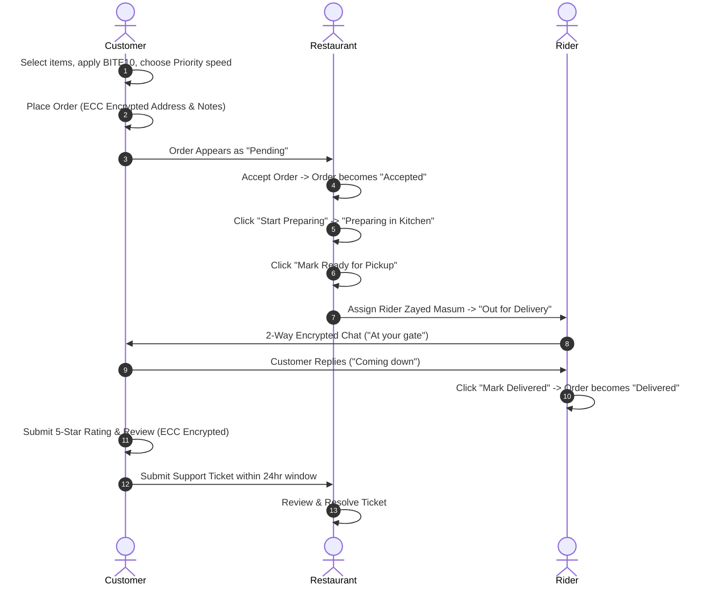

# 🍔 BiteRush 2.0 — Complete Manual Testing Guideline & Master Verification Checklist

---

## 📋 Testing Setup & Prerequisites

### 1. Recommended Browser Setup
* **Main Browser Window (Regular Mode):** Use for your **Customer** account.
* **Incognito Window 1:** Use for the **Restaurant Kitchen** account.
* **Incognito Window 2 (or Second Browser like Edge/Firefox):** Use for the **Delivery Rider** account.
* **Incognito Window 3:** Use for the **Administrator** account.
> 💡 *Testing all four roles simultaneously allows you to see live order updates, kitchen transitions, and 2-way encrypted chat in real time without constantly logging in and out.*

### 2. Pre-Configured Test Credentials
| Portal / Role | Email | Password | Primary Routes |
| :--- | :--- | :--- | :--- |
| 👤 **Customer** | `customer@biterush.com` | `Password123!` | `/dashboard`, `/menu`, `/cart`, `/orders`, `/community`, `/profile` |
| 🍳 **Restaurant** | `restaurant@biterush.com` | `Password123!` | `/restaurant`, `/restaurant/menu`, `/restaurant/orders`, `/restaurant/support` |
| 🛵 **Delivery Rider** | `rider@biterush.com` | `Password123!` | `/rider`, `/rider/deliveries` |
| 🛡️ **Administrator** | `admin@biterush.com` | `Password123!` | `/admin`, `/admin/users`, `/admin/orders`, `/admin/products`, `/admin/create-admin` |

### 3. Developer Tools (Inspect Mode)
Open **Chrome / Edge DevTools** (`F12` or `Right Click > Inspect`), switch to the **Network** tab, and filter by `Fetch/XHR`. This allows you to inspect the JSON payloads and verify the cryptographic ciphertexts and blind lookup HMACs.

---

## 🔐 PART 1: Cryptography & Security Subsystem Testing

### 1.1 Password Hashing & Salting (`bcryptjs`, 10 Rounds)
* [ ] **Registration Password Protection:**
  1. Open `/sign-up` in Incognito.
  2. Register a new user (e.g., `testuser@example.com`, password: `SecretPassword123!`).
  3. **Verification:** In the registration network request (`POST /api/sign-up`), check that the password is sent over HTTPS and hashed with bcrypt on the server. The password is never stored or displayed in plain text.
  4. Try creating an account with mismatched passwords or passwords under 8 characters to confirm client and server validation.

---

### 1.2 Deterministic Blind Lookup HMAC (Zero-Knowledge Indexing)
* **Underlying Algorithm:** `HMAC-SHA256(email.trim().toLowerCase(), CRYPTO_PEPPER_SECRET)`.
* [ ] **Case-Insensitive & Whitespace-Resilient Login:**
  1. Navigate to `/sign-in`.
  2. In the Email field, type with uppercase letters and trailing spaces: `  CUSTOMER@BITERUSH.COM  `.
  3. Enter password: `Password123!`. Click **Continue**.
  4. **Expected Result:** The system computes `emailLookupHmac`, matches the database index, and proceeds to the 2FA challenge without errors.
* [ ] **Phone Blind Lookup:**
  1. Try logging in using the contact number `+8801700000001` instead of the email.
  2. **Expected Result:** `contactNumberLookupHmac` is generated, and the account is located immediately.

---

### 1.3 Two-Factor Authentication (2FA) & OTP Engine
* **Underlying Algorithm:** RFC 4226 Dynamic Truncation over HMAC-SHA256 (6-digit numeric token, 10-minute validity).
* [ ] **Negative Test (Wrong OTP Rejection):**
  1. At `/sign-in`, enter `customer@biterush.com` and `Password123!`.
  2. When the 6-digit OTP challenge screen appears, enter `000000` (or any invalid 6 digits).
  3. Click **Verify & Sign In**.
  4. **Expected Result:** Red alert: *"Invalid verification code. Please check the 6-digit code and try again."* Session is blocked.
* [ ] **Positive Test (Valid OTP Acceptance):**
  1. Use the 6-digit OTP delivered via email (or displayed on the amber "Demo Mode" banner if testing in a demo environment).
  2. Enter the valid 6-digit code. Click **Verify & Sign In**.
  3. **Expected Result:** Green success state, session cookie created, redirected to `/dashboard`.

---

### 1.4 RSA-1024 Asymmetric Encryption & Decryption (User PII Protection)
* **Underlying Algorithm:** Custom scratch-built BigInt RSA-1024 with PKCS#1 v1.5 padding.
* **Encrypted Fields:** First Name, Last Name, Email, Contact Number, Bio, Restaurant Address.
* [ ] **Profile Data Encryption & Decryption:**
  1. Log in as Customer and go to `/profile`.
  2. Open the **Network** tab in DevTools and refresh the page (`GET /api/user/profile`).
  3. **Verification in Network Response:**
     * In MongoDB / Raw response, the user document has `firstName: "[ENCRYPTED]"`, `email: "[ENCRYPTED]"`.
     * The encrypted PII fields contain ciphertext envelopes:
       ```json
       "firstNameEncrypted": "{\"alg\":\"RSA-1024\",\"v\":1,\"ct\":[\"...\"]}"
       ```
     * In the server response delivered to your authenticated session, the server decrypted the envelope into readable plain text (`"Niloy"`, `"Farhan"`, `"customer@biterush.com"`).
* [ ] **Profile Update Re-encryption:**
  1. On `/profile`, edit your Bio: `"Foodie and security enthusiast."`.
  2. Click **Save Changes**.
  3. **Verification:** The request triggers `POST /api/user/update`, which executes RSA encryption with the active public key before updating MongoDB.

---

### 1.5 ECC SECP256K1 ElGamal Asymmetric Encryption (Orders, Chat & Reviews)
* **Underlying Algorithm:** Elliptic Curve Cryptography on `secp256k1` using ElGamal point multiplication & Koblitz encoding.
* **Encrypted Fields:** Delivery Instructions, Shipping Address, Rider-Customer Chat Messages, Customer Reviews, Support Tickets.
* [ ] **Encrypted Order Details:**
  1. Add any burger to your cart and proceed to `/checkout`.
  2. In **Delivery Instructions**, type: `Leave at door 4B. Passcode is 9981.`.
  3. Place the order.
  4. Open DevTools Network tab and check `POST /api/orders` payload and the subsequent `GET /api/orders/[id]`:
     * MongoDB stores:
       ```json
       "deliveryInstructionsEncrypted": "{\"alg\":\"ECC-SECP256K1\",\"v\":1,\"c1\":\"...\",\"c2\":\"...\"}"
       ```
     * Authorized Customer, Restaurant, and Rider can read the decrypted text in their respective portals.
* [ ] **Encrypted In-App Rider Chat:**
  1. Open the live order tracking page (`/orders/[id]`).
  2. Open the in-app chat drawer with the rider.
  3. Send: `I am waiting at the main entrance gate.`.
  4. Check `POST /api/orders/[id]/chat`.
  5. **Verification:** The message text is converted into an ECC ciphertext envelope (`textEncrypted`) before persisting. The recipient rider sees the decrypted message.

---

### 1.6 Message Authentication Code (MAC) Data Integrity & Anti-Tamper Detection
* **Underlying Algorithm:** `HMAC-SHA256(canonicalPayload, CRYPTO_PEPPER_SECRET)`.
* [ ] **Order Integrity Validation:**
  1. When an order is placed, `CryptoService.generateIntegrityMac()` calculates a 64-character hex signature over:
     `{ userId, itemsPrice, totalPrice, shippingPrice, createdAt }`.
  2. Every time `/api/orders/[id]` is fetched, the server recomputes the HMAC and verifies `isIntegrityValid`.
* [ ] **Community Post Integrity Verification (`/community`):**
  1. Go to `/community` and click **Create Post**.
  2. Title: `Best Truffle Fries in Town!`, Category: `Food Review`, Content: `Crispy on the outside, soft inside!`.
  3. Click **Encrypting & Publishing...**.
  4. Inspect `POST /api/posts`: Check that both `titleEncrypted` and `contentEncrypted` are ECC envelopes, and `integrityMac` is a 64-character SHA-256 HMAC.
  5. View the post in the feed: The post opens cleanly because `verifyIntegrityMac` returns `true`.
  > *(If an attacker directly changes the post's title in the database, the API returns a HTTP 409 error: `CRITICAL_TAMPER_ALERT: Post data integrity verification failed!`).*

---

### 1.7 Key Management & Multi-Version Key Rotation
* [ ] **Key Distribution Inspection:**
  1. Log in as **Administrator** (`admin@biterush.com`).
  2. In your browser or Postman/cURL, access: `GET /api/admin/keys`.
  3. **Verification:** You will receive a JSON response containing:
     * `activeVersion: 1`
     * Registered algorithms (`RSA-1024-PKCS1`, `ECC-SECP256K1-ELGAMAL`, `HMAC-SHA256`)
     * Formatted Public Keys: `rsaPublicKey` (`e:n`) and `eccPublicKey` (`Qx:Qy`).
     * Status: `"Operational"`.
* [ ] **On-Demand Key Rotation Execution:**
  1. Send a `POST /api/admin/keys` (via DevTools Console: `await fetch('/api/admin/keys', {method: 'POST'})`).
  2. **Verification:** Response returns `"Keys rotated successfully"`, and `newVersion` becomes `2`.
  3. Create a new community post or order: Observe that new records use `cryptoVersion: 2`.
  4. Browse older posts or orders (created under version 1): Confirm they still decrypt seamlessly because `KeyManager` preserves historical keyrings in its keyring table.

---

### 1.8 Role-Based Access Control (RBAC) & Middleware Route Protection
* [ ] **Customer Access Restrictions:**
  1. While logged in as `customer@biterush.com`, attempt to navigate to:
     * `/restaurant` ➡️ **Must immediately redirect to `/dashboard`**.
     * `/rider` ➡️ **Must immediately redirect to `/dashboard`**.
     * `/admin` ➡️ **Must immediately redirect to `/dashboard`**.
* [ ] **Unauthenticated Redirection:**
  1. Open a new private window (not logged in) and try to open `/checkout` or `/profile`.
  2. **Expected Result:** Automatically redirected to `/sign-in?redirect=/checkout` (or `/profile`).
* [ ] **Homepage Smart Redirection:**
  1. Navigate to `/` while logged in as Restaurant ➡️ Redirects to `/restaurant`.
  2. Navigate to `/` while logged in as Rider ➡️ Redirects to `/rider`.
  3. Navigate to `/` while logged in as Admin ➡️ Redirects to `/admin`.
  4. Navigate to `/` while logged in as Customer ➡️ Redirects to `/dashboard`.

---

## 🍔 PART 2: End-to-End Business Flow & Order Lifecycle Testing

Follow this scenario across 3 synchronized browser windows to test the entire order pipeline:



### Step 1: Customer Order Placement
1. **Browse Menu:** Go to `/menu`. Filter by category (Burgers, Pizza, Pastas, Desserts, Drinks) and use search to locate dishes.
2. **Add to Cart:** Add 2 items (e.g., *Spicy Beef Deluxe Burger* and *Truffle Fries*).
3. **Open Cart Drawer:** Adjust quantity (+ / -) and verify the subtotal updates dynamically.
4. **Checkout Page (`/checkout`):**
   * **Delivery Tier:** Select **Priority (20-30 min)**. Observe delivery fee updates to ৳60.
   * **Rider Tipping:** Select **৳30** tip.
   * **Coupon Code:** Enter `BITE10` and click apply. Confirm 10% discount is applied to the total.
   * **Delivery Instructions:** Enter `"Ring the bell twice, sleeping baby."`
   * **Payment Method:** Choose **Cash on Delivery (COD)**.
5. **Place Order:** Click **Place Order Now**.
6. **Result:** Instantly redirected to `/orders/[id]` with a live 4-stage stepper showing **Order Placed (Pending)** and an active dynamic ETA countdown timer.

---

### Step 2: Customer Pending Cancellation Test (Optional Branch)
1. While the order is in **Pending** state, an orange **Cancel Order** button is available on `/orders/[id]`.
2. Click **Cancel Order** on a test order.
3. **Verification:** The order immediately transitions to **Cancelled**, the kitchen receives the cancellation, and further progress is halted.
*(For the full walkthrough below, place a fresh order and do not cancel it).*

---

### Step 3: Restaurant Kitchen Acceptance & Preparation
1. Switch to the **Restaurant Window** (`/restaurant/orders`).
2. The customer's newly placed order appears under the **Pending** tab.
3. Click **Accept Order**.
   * Customer window updates: Order status moves to **Accepted**.
4. Click **Start Preparing**.
   * Customer window updates: Stepper moves to **Preparing in Kitchen**.
5. Click **Mark Ready for Pickup**.
   * Order moves to the ready-for-dispatch queue.

---

### Step 4: Restaurant Rider Dispatch
1. On the order card in `/restaurant/orders`, click **Assign Rider**.
2. Select **Zayed Masum (Motorcycle)** from the list of active riders.
3. Confirm assignment.
4. **Result:** Order status moves to **Out for Delivery**.

---

### Step 5: Rider Delivery Queue & Live 2-Way Chat
1. Switch to the **Rider Window** (`/rider/deliveries`).
2. The newly dispatched delivery appears in the active deliveries queue.
3. Review the delivery card:
   * Decrypted customer name and contact phone number.
   * Decrypted delivery address and drop-off instructions (`"Ring the bell twice, sleeping baby."`).
4. **Test 2-Way Chat:**
   * In the Rider window, open the **Chat with Customer** modal.
   * Send: `"Hello! I'm 5 minutes away on my motorcycle."`
   * In the Customer window (`/orders/[id]`), open the chat drawer: The message appears instantly.
   * Customer replies: `"Thanks, I'll be waiting downstairs!"`
   * Confirm the rider receives the reply.

---

### Step 6: Order Delivery Handover & COD Settlement
1. In the **Rider Window**, click **Mark Delivered**.
2. **Verification:**
   * Order status updates to **Delivered**.
   * For Cash on Delivery, `isPaid` is automatically set to `true`, and `paidAt` is stamped.
   * In the Customer window, the progress stepper completes to **Delivered (Stage 4)**.

---

### Step 7: Post-Delivery 5-Star Rating & Review
1. In the **Customer Window** on `/orders/[id]`, scroll to the newly unlocked **Rate & Review** section.
2. Select **5 Stars** and enter review text: `"Food arrived steaming hot! Rider was super polite."`
3. Click **Submit Review**.
4. **Verification:** The review is saved with ECC encryption (`reviewEncrypted`). The rider's profile and the product ratings are updated.

---

### Step 8: 24-Hour Post-Delivery Support Window
1. On `/orders/[id]`, locate the **Need Help With This Order?** section (active for 24 hours post-delivery).
2. Select Issue Type: **Missing Item** or **Food Quality / Damaged**.
3. Description: `"The extra drink was missing from the bag."`
4. Click **Submit Support Ticket**.
5. Switch to the **Restaurant Window** (`/restaurant/support`):
   * The new support ticket appears.
   * Click **Resolve Ticket**, type: `"Apologies for the inconvenience! We have issued a ৳100 credit."`
   * Submit the resolution.
6. Refresh the Customer window: Ticket status updates to **Resolved** with the restaurant's response visible.

---

## 👤 PART 3: Customer Portal Feature Checklist

* [ ] **Personalized Customer Dashboard (`/dashboard`):**
  * Active order banner at the top linking to the live tracker.
  * Personalized recommendations dynamically highlighting favorite categories.
  * "Trending Right Now" carousel with one-click Add to Cart buttons.
* [ ] **Interactive AI Chatbot Widget (`Chatbot.tsx`):**
  * Click the floating bot icon in the bottom-right corner of `/dashboard`.
  * Click quick prompts: *"What are today's specials?"*, *"Track my current order"*, *"How does delivery work?"*.
  * Confirm fast, helpful responses and clean expand/minimize behavior.
* [ ] **Community Food Board (`/community`):**
  * View posts with category pills (*Food Review*, *Restaurant Recommendation*, *Diet & Recipes*, *General Discussion*).
  * Filter posts by category.
  * Like/Unlike a post and verify the counter increments.
  * Edit your own post (confirms ECC re-encryption and HMAC MAC update).
  * Delete your own post and verify it disappears from the feed.
* [ ] **Customer Profile Settings (`/profile`):**
  * Verify all decrypted fields display properly (Name, Phone, Email).
  * Toggle **Theme Preference** between Light and Dark mode.
  * Change status between **Online**, **Away**, and **Busy**.

---

## 🍳 PART 4: Restaurant Portal Feature Checklist

* [ ] **Operations Overview (`/restaurant`):**
  * Verify 4 live metric cards: Total Menu Items, Incoming Pending Orders, Active Kitchen Orders, and Completed Deliveries.
* [ ] **Menu Management CRUD (`/restaurant/menu`):**
  * **Add Dish:** Click "Add New Dish", upload/enter image URL, name, description, price (৳), category, and prep time. Save.
  * **Stock Availability Toggle:** Click the **In Stock / Out of Stock** switch on any dish. Open `/menu` in a customer window and verify the item immediately reflects "Sold Out".
  * **Edit Dish:** Change price or prep time and verify update.
  * **Delete Dish:** Delete an item and confirm removal from both portal and customer menu.
* [ ] **Order Management Pipeline (`/restaurant/orders`):**
  * Filter tabs: *All, Pending, Accepted, Preparing, Ready, Out for Delivery, Delivered, Declined*.
  * Test the **Decline Order** flow on a test order.

---

## 🛵 PART 5: Delivery Rider Portal Feature Checklist

* [ ] **Rider Dashboard (`/rider`):**
  * Metrics: Active Deliveries, Total Completed Drops, and Accumulated Tips (৳).
* [ ] **Active Deliveries Queue (`/rider/deliveries`):**
  * Delivery cards show customer name, drop-off coordinates, address, and special instructions.
  * Order items list shows items and quantities for kitchen bag verification.
  * Direct Call button triggers phone link (`tel:+880...`).
  * Direct Chat modal functions with live message exchanges.
  * 1-Click "Mark Delivered" completes order and settles COD payments.

---

## 🛡️ PART 6: Administrator Portal Feature Checklist

* [ ] **Admin Dashboard (`/admin`):**
  * Card navigation to Users, Products, Orders, and Key Management.
* [ ] **User Management Directory (`/admin/users`):**
  * View all registered customers, restaurants, riders, and admins.
  * Verify names and emails are properly decrypted in the table.
  * Ability to change user roles or toggle account active status.
* [ ] **Product Catalog Oversight (`/admin/products`):**
  * Inspect global catalog and pricing across all categories.
* [ ] **Global Orders Management (`/admin/orders`):**
  * View all platform transactions, payment statuses, and delivery states.
* [ ] **Admin Account Onboarding (`/admin/create-admin`):**
  * Fill in First Name, Last Name, Email, Contact Number, and Password.
  * Submit and verify new administrator creation with RSA-encrypted PII and `emailLookupHmac`.

---

## ✅ Master Verification Checklist

Print or copy this final checklist to track your test run:

| Module | Test Case | Expected Result | Pass / Fail |
| :--- | :--- | :--- | :---: |
| **Auth** | Sign Up (New User) | User created with bcrypt hash & RSA encrypted PII | [ ] |
| **Auth** | Blind Lookup Login | Trimmed/cased email matches HMAC lookup token | [ ] |
| **Auth** | 2FA Challenge (Wrong Code) | Code `000000` rejected with descriptive error | [ ] |
| **Auth** | 2FA Challenge (Valid Code) | Valid 6-digit OTP completes login to dashboard | [ ] |
| **Crypto** | RSA PII Protection | Names/Emails stored as `[ENCRYPTED]` in DB; decrypted in UI | [ ] |
| **Crypto** | ECC Order Encryption | Shipping address & delivery instructions encrypted with ElGamal | [ ] |
| **Crypto** | ECC 2-Way Chat | Rider-Customer chat messages encrypted in DB | [ ] |
| **Crypto** | HMAC Data Integrity | Orders & Posts verified with HMAC-SHA256 MAC | [ ] |
| **Crypto** | Key Management | `GET /api/admin/keys` shows active keys; `POST` rotates version | [ ] |
| **Security**| Route Guards (RBAC) | Customer blocked from `/restaurant`, `/rider`, `/admin` | [ ] |
| **Ordering**| Cart & Coupon Code | `BITE10` applies 10% discount; priority delivery adds ৳60 | [ ] |
| **Ordering**| Pending Cancellation | Customer can cancel order while in `Pending` state | [ ] |
| **Kitchen** | Order Progression | Pending ➡️ Accepted ➡️ Preparing ➡️ Ready for Pickup | [ ] |
| **Kitchen** | Rider Dispatch | Restaurant dynamically assigns rider; status becomes Out for Delivery | [ ] |
| **Rider** | Deliveries Queue | Rider views decrypted drop-off notes & customer phone | [ ] |
| **Rider** | Mark Delivered | 1-Click completion auto-settles COD payments to `isPaid: true` | [ ] |
| **Review** | 5-Star Rating | Customer submits rating & review post-delivery | [ ] |
| **Support** | 24-Hr Ticket Filing | Customer files ticket; Restaurant resolves with response | [ ] |
| **Community**| Encrypted Posts | Create, edit, and like posts with ECC encryption & HMAC MAC | [ ] |
| **Admin** | User & Orders Control | Admin inspects all users and platform orders | [ ] |
