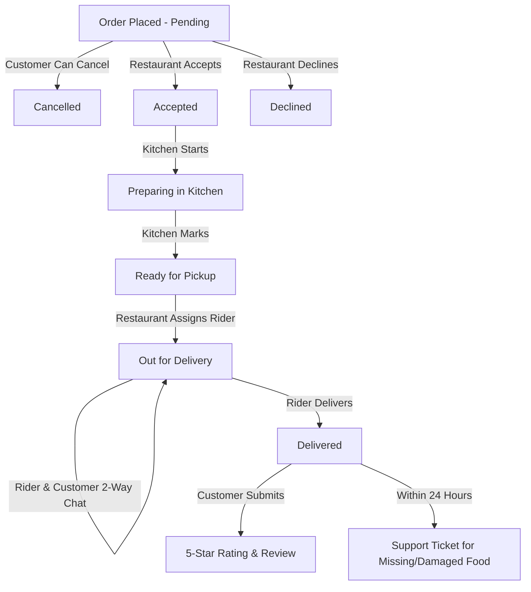

# 🍔 BiteRush 2.0 — Modern Food Delivery Ecosystem


> **BiteRush 2.0** is an enterprise-grade, full-stack food delivery web application built with **Next.js 15 (App Router)**, **TypeScript**, **MongoDB/Mongoose**, and **NextAuth.js**. Featuring **three dedicated role portals** (Customer, Restaurant Manager, Delivery Rider), live 4-stage order tracking, dynamic ETA countdowns, direct 2-way in-app rider chat, customer cancellation, 5-star rating & reviews, a 24-hour post-delivery support window, personalized recommendation feed, and instant 1-click test logins.

---

## 🚀 Key Highlights & What's New in 2.0

### 👥 1. Three Independent Role Modules
* **Customer Portal (`/dashboard`, `/menu`, `/cart`, `/checkout`, `/orders`)**:
  * Personalized feed powered by past order history & trending picks.
  * Live 4-stage tracking stepper with dynamic ETA countdown.
  * Direct 2-way in-app chat with assigned delivery riders.
  * 1-click customer cancellation for pending orders.
  * Post-delivery 5-star rating & text review submission.
  * 24-hour post-delivery customer support ticket window.
* **Restaurant Portal (`/restaurant`, `/restaurant/menu`, `/restaurant/orders`, `/restaurant/support`)**:
  * Real-time metrics dashboard (menu count, pending, active, completed orders).
  * Full menu CRUD with stock availability toggle (**In Stock** / **Out of Stock**) & image preview.
  * Order lifecycle management: **Accept**, **Decline**, **Start Preparing**, **Mark Ready**.
  * Dynamic **Rider Assignment & Dispatch** from active delivery riders.
  * Dedicated Customer Support Resolver for order issue tickets.
* **Rider Portal (`/rider`, `/rider/deliveries`)**:
  * Active delivery queue with customer drop-off notes & gate instructions.
  * Real-time in-app 2-way messaging with customers.
  * 1-click **Mark Delivered** (auto-marks Cash on Delivery orders as paid).
  * Completed delivery history, ratings received, and tips earnings tracker.

---

## ⚡ 1-Click Pre-Configured Test Logins

Test any role instantly from the `/sign-in` page with pre-seeded demo profiles:

| Role | Email | Password | Primary Capabilities |
| :--- | :--- | :--- | :--- |
| 👤 **Customer** | `customer@biterush.com` | `Password123!` | Browse menu, checkout, live tracking, chat, rate & review |
| 🍳 **Restaurant** | `restaurant@biterush.com` | `Password123!` | Manage menu, accept/decline orders, assign riders, resolve support |
| 🛵 **Rider** | `rider@biterush.com` | `Password123!` | View active deliveries, chat with customer, mark delivered, tips |

---

## 📦 Complete Order Lifecycle & Tracking



1. **Checkout & Payment**:
   * Delivery options: **Saver (45-60 min)**, **Standard (30-40 min)**, **Priority (20-30 min)**.
   * Payment options: **Cash on Delivery (COD)**, **bKash / Mobile Wallet**, **Card / Debit Card**.
   * Optional **Delivery Instructions** passed directly to restaurant & rider.
   * Rider tipping & coupon discounts (`BITE10` for 10% off).
2. **Live Order Tracker (`/orders/[id]`)**:
   * **4-Stage Stepper**: Visual progression of order fulfillment.
   * **Dynamic Countdown**: Real-time remaining minutes calculated from delivery speed.
   * **Live Rider Info**: Assigned rider name, vehicle type, and direct contact.
   * **2-Way Chat**: Instant in-app messaging modal.

---

## 🛠️ Technology Stack

* **Framework**: [Next.js 15](https://nextjs.org/) (App Router, Turbopack, Server Actions & Route Handlers)
* **Language**: [TypeScript](https://www.typescriptlang.org/) (Strict mode, end-to-end type safety)
* **Database & ODM**: [MongoDB](https://www.mongodb.com/) + [Mongoose 8](https://mongoosejs.com/)
* **Authentication**: [NextAuth.js](https://next-auth.js.org/) (JWT stateless strategy, role claims & middleware guards)
* **Styling & UI**: [Tailwind CSS 4](https://tailwindcss.com/), [Radix UI](https://www.radix-ui.com/), [Lucide Icons](https://lucide.dev/), Sonner Toasts
* **Security & Utility**: [bcryptjs](https://www.npmjs.com/package/bcryptjs) (Salt hashing), [Zod](https://zod.dev/) validation

---

## 📂 Project Structure

```text
├── src/
│   ├── app/
│   │   ├── (auth)/             # Sign-in (w/ 1-click demo buttons), Sign-up, Password reset
│   │   ├── (public)/           # Public landing page, menu, cart, checkout, payment, live order tracking
│   │   ├── (restaurant)/       # Dedicated Restaurant Dashboard, Menu CRUD, Order Management, Support
│   │   ├── (rider)/            # Dedicated Rider Dashboard, Active Deliveries, Chat, Delivery History
│   │   ├── api/
│   │   │   ├── auth/           # NextAuth route handlers & JWT role callbacks
│   │   │   ├── orders/         # Order creation, details, cancellation, chat, rating, support
│   │   │   ├── products/       # Products API & filtering
│   │   │   ├── recommendations/# AI/Heuristic customer recommendation engine
│   │   │   ├── restaurant/     # Restaurant products, orders, rider assignment
│   │   │   ├── rider/          # Rider deliveries & completion
│   │   │   └── seed/           # Auto-seed demo accounts & realistic dishes
│   │   ├── layout.tsx          # Root layout with theme provider & navigation
│   │   └── globals.css         # Global design system & animations
│   ├── components/
│   │   ├── customUi/Navbar.tsx # Role-aware navigation with dynamic badges
│   │   └── ui/                 # Reusable Radix & Tailwind components
│   ├── models/
│   │   ├── User.ts             # User schema with 3 roles (customer, restaurant, rider)
│   │   ├── Order.ts            # Order schema with lifecycle statuses, chat, rating, support
│   │   └── Product.ts          # Product schema with stock & availability toggle
│   ├── lib/
│   │   ├── dbConnect.ts        # Cached MongoDB connection handler
│   │   └── seedDemoUsers.ts    # Complete seed data with 16 realistic food items
│   └── middleware.ts           # Route protection & role-based redirection guards
├── package.json
└── tsconfig.json
```

---

## ⚙️ Getting Started

### Prerequisites
* [Node.js](https://nodejs.org/) (v18.17.0 or newer)
* [MongoDB](https://www.mongodb.com/) (Local instance or MongoDB Atlas cluster)

### 1. Clone the Repository
```bash
git clone https://github.com/ftniloy5757/BiteRush2.0.git
cd BiteRush2.0
```

### 2. Install Dependencies
```bash
npm install
```

### 3. Environment Configuration
Create a `.env.local` file in the root directory:
```env
MONGODB_URI=your_mongodb_connection_string
NEXTAUTH_SECRET=your_nextauth_secret_key
NEXTAUTH_URL=http://localhost:3000
```

### 4. Seed Demo Data & Start Development Server
```bash
npm run dev
```

Open [http://localhost:3000](http://localhost:3000) in your browser.
Navigate to `/sign-in` and click any of the **1-Click Demo Login** buttons to automatically seed the database and explore all role features!

---

## 🧪 Build & Typecheck Verification

Run the full TypeScript verification and production build:
```bash
# Check TypeScript compilation
npx tsc --noEmit

# Run Next.js production build
npm run build
```

---

## 📄 License
This project is open source and available under the [MIT License](LICENSE).
