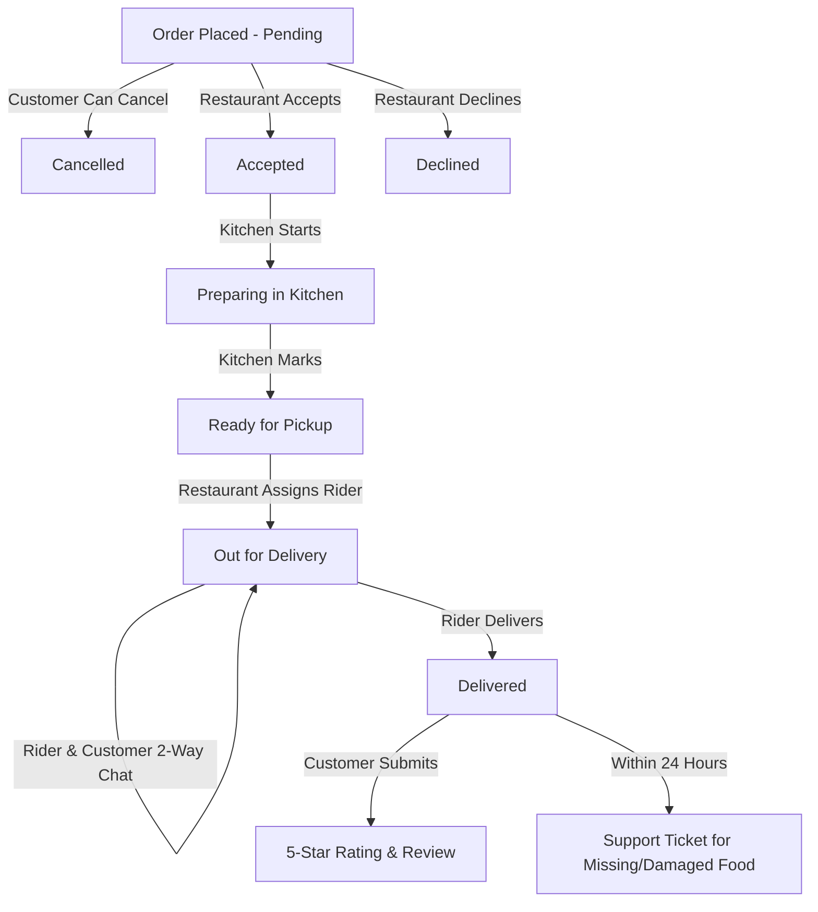

# 🍔 BiteRush 2.0 — Modern Food Delivery Ecosystem


> **BiteRush 2.0** is an enterprise-grade, full-stack food delivery web application built with **Next.js 15 (App Router)**, **TypeScript**, **MongoDB/Mongoose**, and **NextAuth.js**. Featuring **three dedicated portals** (Customer, Restaurant Management, Delivery Rider), live 4-stage order tracking, dynamic ETA countdowns, direct 2-way in-app rider chat, customer cancellation, 5-star rating & reviews, a 24-hour post-delivery support window, and personalized recommendation feeds.

---

## 🌟 Key Modules & Features

### 👤 1. Customer Experience & Ordering
* **Interactive Menu & Food Discovery**:
  * Browse hundreds of gourmet dishes across Burgers, Pizzas, Pastas, Desserts, and Drinks with live search & category filters.
  * Publicly accessible menu for guests before creating an account.
* **Smart Cart & Multi-Tier Checkout**:
  * Delivery speed selection: **Saver (45-60 min)**, **Standard (30-40 min)**, **Priority (20-30 min)**.
  * Payment options: **Cash on Delivery (COD)**, **bKash / Mobile Wallet**, **Card / Debit Card**.
  * Optional **Delivery Instructions** passed directly to the kitchen and delivery rider.
  * Rider tipping (৳15, ৳30, ৳50 or custom) & coupon discounts (`BITE10` for 10% off).
* **Live 4-Stage Order Tracker (`/orders/[id]`)**:
  * Real-time visual progress stepper: *Order Placed* ➡️ *Preparing in Kitchen* ➡️ *Out for Delivery* ➡️ *Delivered*.
  * Dynamic ETA countdown timer calculated from order creation time and delivery priority.
  * 1-click **Customer Cancellation** active while the order is pending confirmation.
  * Direct 2-way in-app chat drawer with the assigned delivery rider.
  * Post-delivery interactive 5-star rating and written review submission.
  * 24-hour post-delivery customer support ticket submission window with status tracking.
* **Personalized Customer Feed (`/dashboard`)**:
  * Smart recommendation engine analyzing past order history to surface favorite categories and trending dishes.
  * Active order banner for 1-click access to live tracking.

---

### 🍳 2. Restaurant Portal (`/restaurant`)
* **Real-Time Operations Dashboard**:
  * Live metrics on menu counts, incoming pending orders, active kitchen orders, and completed deliveries.
* **Menu Management (`/restaurant/menu`)**:
  * Full menu CRUD: Add, edit, and delete dishes with photo preview, pricing, category, and preparation time.
  * 1-click stock availability toggle (**In Stock** / **Out of Stock**) to instantly reflect on customer menus.
* **Order Fulfillment Pipeline (`/restaurant/orders`)**:
  * Filter orders by status (*Pending*, *Accepted*, *Preparing*, *Ready for Pickup*, *Out for Delivery*, *Delivered*, *Declined*).
  * **Accept** or **Decline** incoming customer orders.
  * Advance kitchen workflow: **Start Preparing** ➡️ **Mark Ready for Pickup**.
  * Dynamic **Rider Assignment**: Select from active delivery riders for immediate dispatch.
* **Customer Support Resolver (`/restaurant/support`)**:
  * Review and manage support tickets filed by customers for missing or damaged items.

---

### 🛵 3. Delivery Rider Portal (`/rider`)
* **Rider Dashboard (`/rider`)**:
  * Overview of active deliveries, completed deliveries, and tip earnings.
* **Delivery Queue & Route Details (`/rider/deliveries`)**:
  * View assigned deliveries with customer drop-off instructions, contact numbers, and delivery addresses.
  * Direct 2-way in-app chat modal with the customer for turn-by-turn coordinate questions.
  * 1-click **Mark Delivered** (automatically updates Cash on Delivery status to paid).
  * Delivery history review with ratings received from customers.

---

## 📦 Complete Order Lifecycle Flow



---

## 🧪 Pre-Configured Test Accounts

For testing and demonstrating the three role portals, log in with the pre-seeded credentials:

| Role | Email | Password | Primary Portal |
| :--- | :--- | :--- | :--- |
| 👤 **Customer** | `customer@biterush.com` | `Password123!` | `/dashboard`, `/menu`, `/orders` |
| 🍳 **Restaurant** | `restaurant@biterush.com` | `Password123!` | `/restaurant`, `/restaurant/menu`, `/restaurant/orders` |
| 🛵 **Rider** | `rider@biterush.com` | `Password123!` | `/rider`, `/rider/deliveries` |

---

## 🛠️ Technology Stack

* **Framework**: [Next.js 15](https://nextjs.org/) (App Router, Server Components & Route Handlers)
* **Language**: [TypeScript](https://www.typescriptlang.org/) (Strict mode, end-to-end type safety)
* **Database & ODM**: [MongoDB](https://www.mongodb.com/) + [Mongoose 8](https://mongoosejs.com/)
* **Authentication**: [NextAuth.js](https://next-auth.js.org/) (JWT stateless strategy, role claims & middleware route guards)
* **Styling & UI**: [Tailwind CSS 4](https://tailwindcss.com/), [Radix UI](https://www.radix-ui.com/), [Lucide Icons](https://lucide.dev/), Sonner Toasts
* **Security & Utility**: [bcryptjs](https://www.npmjs.com/package/bcryptjs) (Salt hashing), [Zod](https://zod.dev/) validation

---

## 📂 Project Structure

```text
├── src/
│   ├── app/
│   │   ├── (auth)/             # Sign-in, Sign-up, Password reset
│   │   ├── (public)/           # Public landing page, menu, cart, checkout, payment, live order tracking
│   │   ├── (restaurant)/       # Dedicated Restaurant Dashboard, Menu CRUD, Order Management, Support
│   │   ├── (rider)/            # Dedicated Rider Dashboard, Active Deliveries, Chat, Delivery History
│   │   ├── api/
│   │   │   ├── auth/           # NextAuth route handlers & JWT role callbacks
│   │   │   ├── orders/         # Order creation, details, cancellation, chat, rating, support
│   │   │   ├── products/       # Products API & filtering
│   │   │   ├── recommendations/# AI/Heuristic customer recommendation engine
│   │   │   ├── restaurant/     # Restaurant products, orders, rider assignment
│   │   │   ├── rider/          # Rider deliveries & completion
│   │   │   └── seed/           # Auto-seed demo accounts & realistic dishes
│   │   ├── layout.tsx          # Root layout with theme provider & navigation
│   │   └── globals.css         # Global design system & animations
│   ├── components/
│   │   ├── customUi/Navbar.tsx # Role-aware navigation with dynamic badges
│   │   └── ui/                 # Reusable Radix & Tailwind components
│   ├── models/
│   │   ├── User.ts             # User schema with 3 roles (customer, restaurant, rider)
│   │   ├── Order.ts            # Order schema with lifecycle statuses, chat, rating, support
│   │   └── Product.ts          # Product schema with stock & availability toggle
│   ├── lib/
│   │   ├── dbConnect.ts        # Cached MongoDB connection handler
│   │   └── seedDemoUsers.ts    # Complete seed data with 16 realistic food items
│   └── middleware.ts           # Route protection & role-based redirection guards
├── package.json
└── tsconfig.json
```

---

## ⚙️ Getting Started

### Prerequisites
* [Node.js](https://nodejs.org/) (v18.17.0 or newer)
* [MongoDB](https://www.mongodb.com/) (Local instance or MongoDB Atlas cluster)

### 1. Clone the Repository
```bash
git clone https://github.com/ftniloy5757/BiteRush2.0.git
cd BiteRush2.0
```

### 2. Install Dependencies
```bash
npm install
```

### 3. Environment Configuration
Create a `.env.local` file in the root directory:
```env
MONGODB_URI=your_mongodb_connection_string
NEXTAUTH_SECRET=your_nextauth_secret_key
NEXTAUTH_URL=http://localhost:3000
```

### 4. Run Development Server
```bash
npm run dev
```

Open [http://localhost:3000](http://localhost:3000) in your browser.

---

## 🧪 Build & Verification

```bash
# Verify TypeScript types
npx tsc --noEmit

# Run Next.js production build
npm run build
```

---

## 📄 License
This project is open source and available under the [MIT License](LICENSE).
